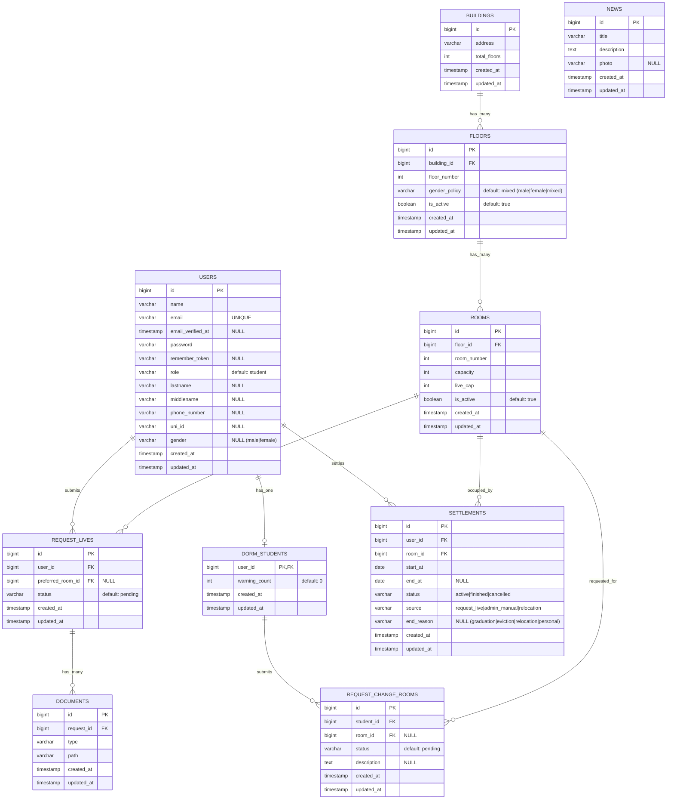
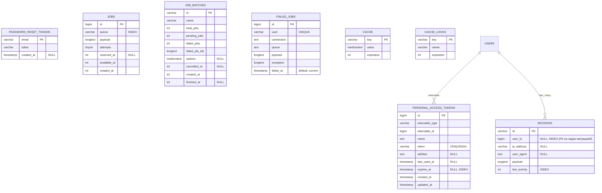

# ERD (по миграциям проекта)

Ниже 2 диаграммы:
1) **Domain**: основные сущности общежитий и заявок.
2) **Infra**: технические таблицы Laravel (auth/sanctum/sessions/jobs/cache).

> Примечание: ERD собран по миграциям. Источник истины проживания: `settlements` (активное проживание = `end_at IS NULL`).

## Domain ERD

## Infra ERD

